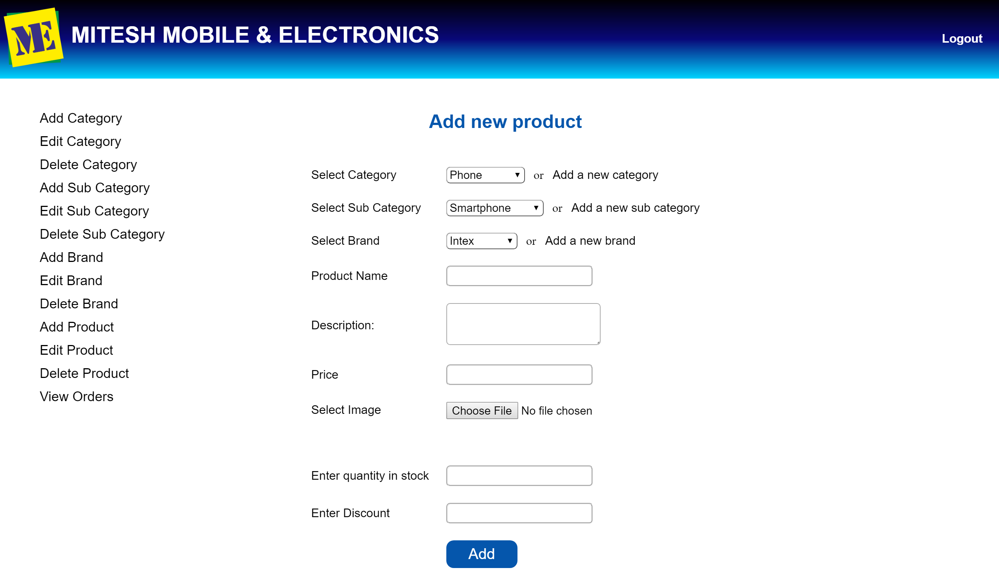
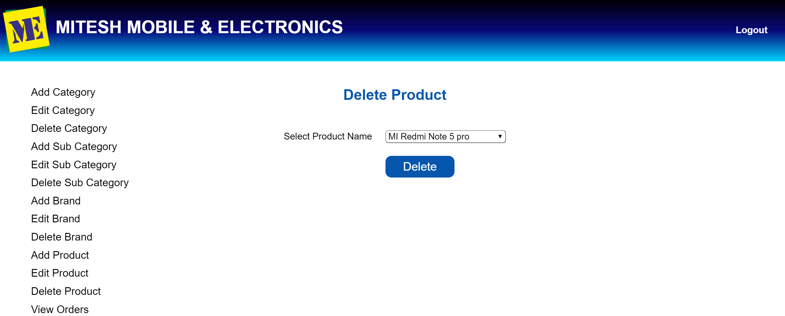
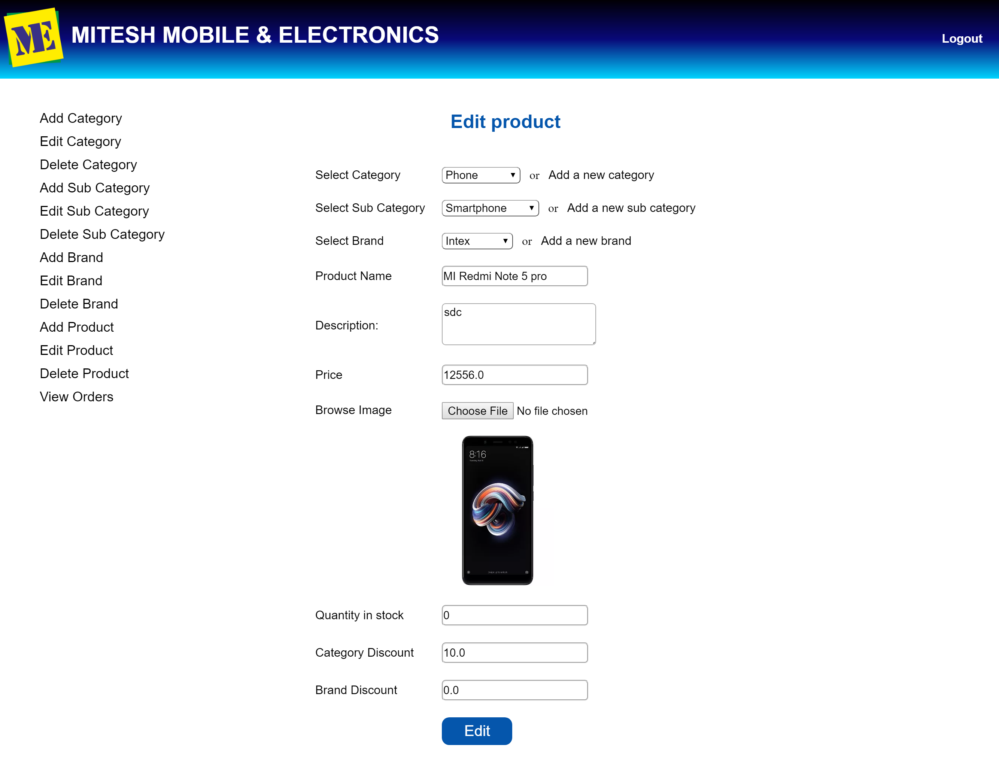
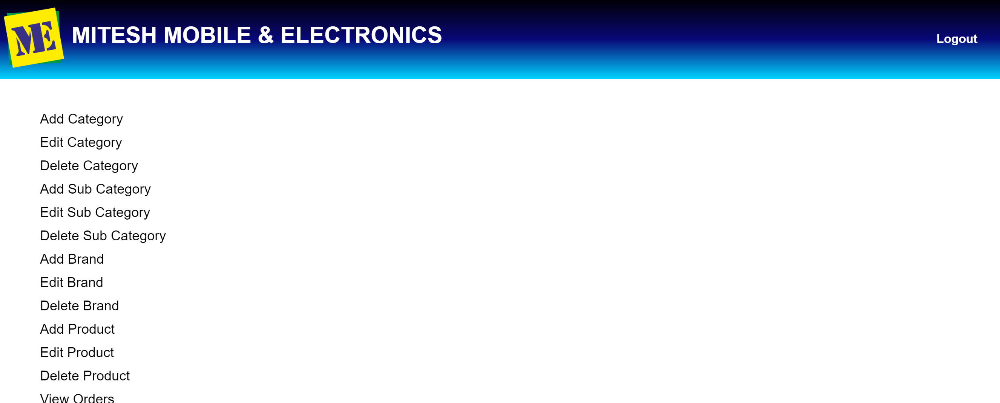

# Mitesh Electronics Admin Module
Admin module for e-commerce website for Mitesh Mobiles and Electronics. 
Mitesh Mobiles and Electronics is based in Tagore Nagar, Vikhroli (East), Mumbai, Maharashtra-400083.
<h3>Technologies used</h3>
  <ul><li>Java Servlets</li> <li>Hibernate</li> <li>JSP</li> <li>HTML</li> <li>CSS</li> <li>Javascript</li> <li>MySQL</li></ul>
The admin module lets you 
  - Perform CRUD operations on category, sub category,brand of products, Create Update Delete Product
  - View pending and delivered orders.

<h5>Screenshots</h5>

